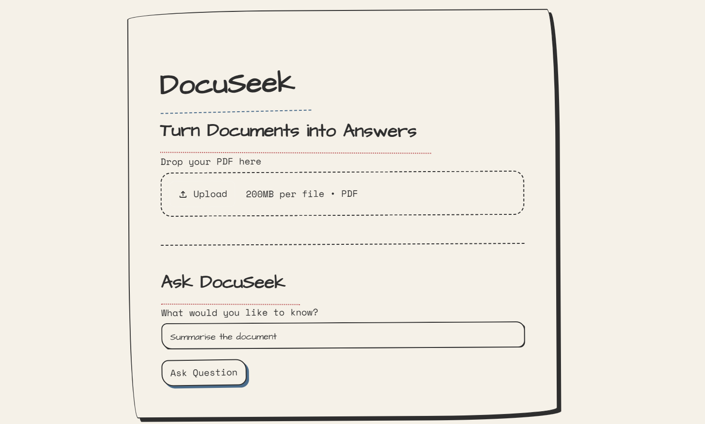

# DocuSeek

<p align="center">
  <h1 align="center">DocuSeek</h1>
  <p align="center">
    <b>Chat with your PDFs using Retrieval-Augmented Generation (RAG)</b>
  </p>
</p>

<p align="center">
  
</p>

---

## Overview

DocuSeek is a Retrieval-Augmented Generation (RAG) application that lets you interact with PDF documents through natural language. Simply upload a PDF, process it, and ask questions about its contents. Instead of searching manually, DocuSeek retrieves the most relevant sections from the document and uses a Large Language Model (LLM) to generate accurate, context-aware answers.

---

## Features

- Upload and process PDF documents
- Semantic search using vector embeddings
- Context-aware question answering
- Fast document retrieval with ChromaDB
- Clean Streamlit interface
- Powered by Groq's Llama 3.3 70B model
- Supports conversational querying over documents

---

## Tech Stack

| Technology | Purpose |
|------------|---------|
| Python | Programming Language |
| Streamlit | User Interface |
| LangChain | RAG Pipeline |
| ChromaDB | Vector Database |
| Hugging Face Embeddings | Text Embeddings |
| Groq API | Large Language Model |

---

## Project Structure

```
DocuSeek/
│
├── assets/
│   └── docuseek-ui.png
│
├── app.py
├── rag.py
├── LLM.py
├── requirements.txt
├── README.md
├── .env
└── chroma_store/          # Generated after processing a PDF
```

---

## Installation

### 1. Clone the repository

```bash
git clone https://github.com/Prelioz/genai-soc-2026.git
cd genai-soc-2026/DocuSeek
```

### 2. Create a Virtual Environment

#### Windows

```bash
python -m venv venv
venv\Scripts\activate
```

#### Linux / macOS

```bash
python3 -m venv venv
source venv/bin/activate
```

---

### 3. Install Dependencies

```bash
pip install -r requirements.txt
```

---

### 4. Configure the API Key

Create a `.env` file inside the project folder.

```env
GROQ_API_KEY=your_groq_api_key
```

---

## Running the Application

Start the Streamlit application:

```bash
streamlit run app.py
```

Open the local URL displayed in your terminal (usually `http://localhost:8501`).

---

## How It Works

1. Upload a PDF document.
2. The document is loaded and split into smaller chunks.
3. Each chunk is converted into embeddings using a Hugging Face embedding model.
4. The embeddings are stored in ChromaDB.
5. When a user asks a question:
   - Relevant document chunks are retrieved.
   - The retrieved context is sent to the LLM.
   - The model generates an answer grounded in the document.

---

## Example Questions

- What is the main objective of this paper?
- Summarize Chapter 2.
- Who are the authors?
- Explain the proposed methodology.
- What are the key findings?
- List the conclusions.

---

## Future Improvements

- Multiple PDF support
- Chat history
- Source citations
- Highlight referenced text
- Hybrid search (Semantic + Keyword)
- PDF preview
- Cloud deployment
- Docker support

---

## Author

**Bhavya Modi**

- GitHub: https://github.com/Prelioz

---

## License

This project is intended for educational and learning purposes.

---

## Acknowledgements

This project utilizes:

- Streamlit
- LangChain
- ChromaDB
- Hugging Face
- Groq API