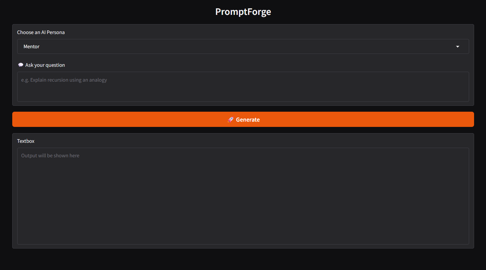
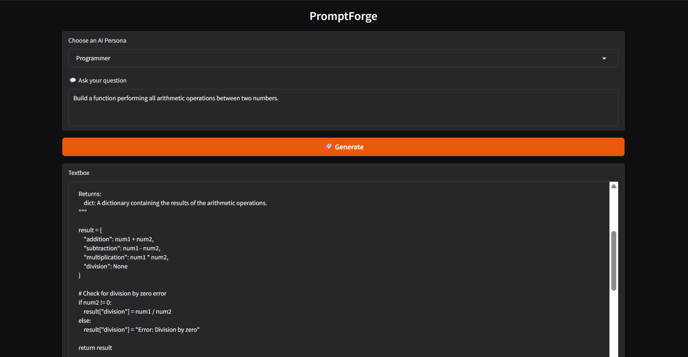
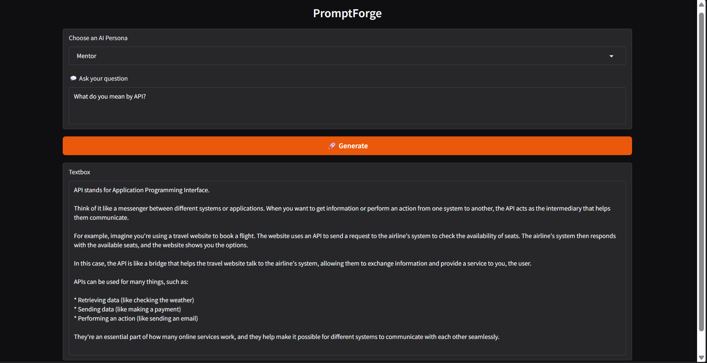
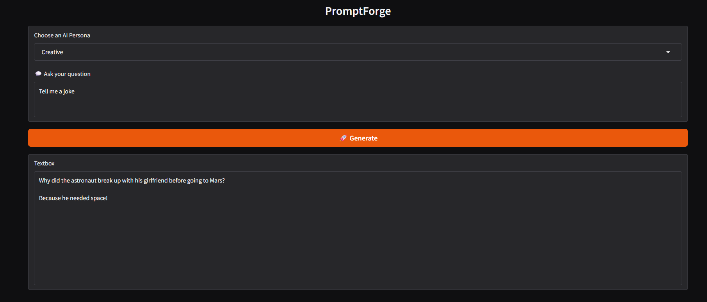
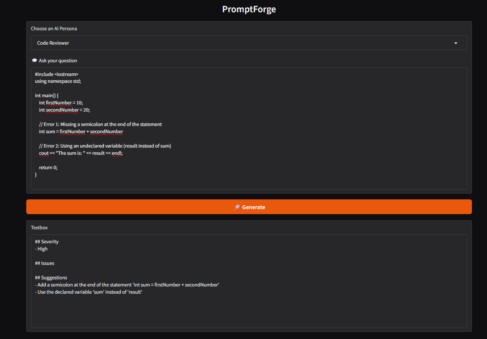

# PromptForge 🚀

PromptForge is a Gradio-powered AI application that showcases prompt engineering through multiple specialized AI personas. Each persona is designed to respond differently, providing users with tailored assistance based on their chosen role.

## ✨ Features

- 🎓 Mentor Persona – Explains concepts clearly and step-by-step.
- 💻 Programmer Persona – Helps with coding, debugging, and technical questions.
- 🎨 Creative Persona – Generates creative ideas, stories, and content.
- 🔍 Code Reviewer Persona – Reviews code for bugs, readability issues, and best practices.
- ⚡ Real-time streaming responses.
- 🧠 Few-shot prompting for improved persona consistency.
- 📋 Structured JSON parsing for Code Reviewer outputs.

---

## 🛠️ Tech Stack

- Python
- Gradio
- Groq API
- Llama 3.3 70B Versatile
- Prompt Engineering

---

## 📸 Screenshots

### Home Screen


### Programmer Persona


### Mentor Persona


### Creative Persona


### Code Reviewer Persona


---

## 🚀 Installation

Clone the repository:

```bash
git clone <your-repository-url>
cd promptForge
```

Create a virtual environment:

```bash
python -m venv venv
```

Activate it:

### Windows

```bash
venv\Scripts\activate
```

### macOS/Linux

```bash
source venv/bin/activate
```

Install dependencies:

```bash
pip install -r requirements.txt
```

---

## 🔑 Environment Variables

Create a `.env` file in the project root:

```env
GROQ_API_KEY=your_api_key_here
```

---

## ▶️ Run the Application

```bash
python app.py
```

---

## 🔍 Code Reviewer Mode

The Code Reviewer persona returns structured JSON containing:

- Issues
- Suggestions
- Severity Level

The application parses the JSON response and displays a formatted review for improved readability.

---

## 🎯 What I Learned

Through this project, I practiced:

- Prompt Engineering
- Few-Shot Prompting
- LLM Integration
- Response Streaming
- JSON Parsing
- Gradio UI Development

---

## 🔮 Future Improvements

- Additional personas
- Conversation memory
- Export chat history
- Custom persona creation
- Enhanced UI styling

---

## 👨‍💻 Author

**Bhavya Modi**

Built as part of my Generative AI learning journey.